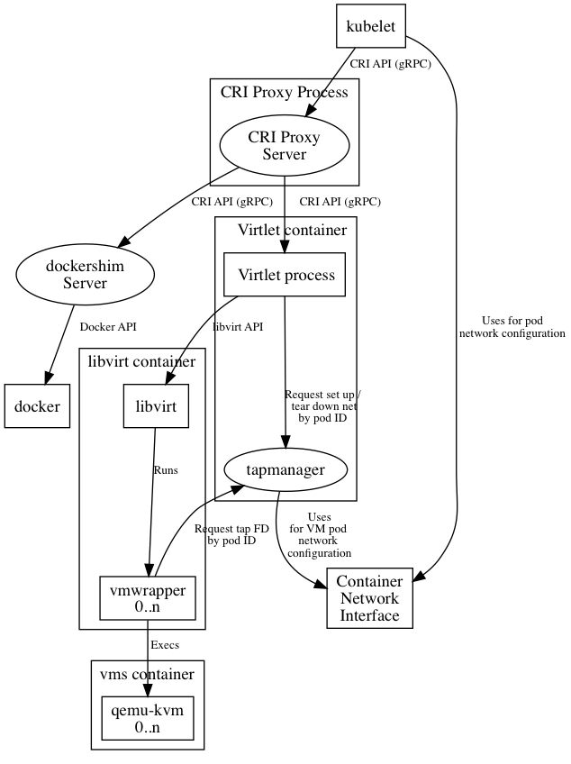

# Overview

The following figure provides a general view of Virtlet architecture:

Virtlet consists of the following components:

* [Virtlet manager](../cmd/virtlet) - implements CRI interface for virtualization and image handling
* [libvirt](http://libvirt.org) instance
* [tapmanager](../pkg/tapmanager) which is responsible for managing VM networking
* [vmwrapper](../cmd/vmwrapper) which is responsible for setting up the environment for emulator
* emulator, currently [qemu](http://www.qemu-project.org/) with KVM support (with possibility to disable KVM)

In addition to the above, our example setup provides the following:

* [Image service](../deploy/image-service.yaml) which provides VM images accessible through HTTP in local cluster environment. It's only used as an optional helper, because Virtlet manager can pull images from any HTTP server accessible from the node.
* [CRI proxy](../cmd/criproxy) which provides the possibility to mix docker-shim and VM based workloads on the same k8s node.

## Virtlet manager

The main binary is responsible for providing API fullfiling
[CRI specification](https://github.com/kubernetes/community/blob/master/contributors/design-proposals/container-runtime-interface-v1.md).
It serves the requests from kubelet by doing the following:

* setting up libvirt VM environment (virtual drives, network
  interfaces, trimming resources like RAM, CPU)
* requesting CNI setup from tapmanager (see below)
* telling libvirt to call vmwrapper instead of using emulator directly
* querying libvirt for VM statuses
* instructing libvirt to stop VMs
* requesting CNI teardown from tapmanager (see below)
* and finally calling libvirt to tear down VM environment.

## tapmanager

`tapmanger` is a process that controls the setup of VM networking
using CNI which is started by `virtlet` command (it uses the same
`virtlet` binary). It has the following responsibilities:
* takes setup requests from Virtlet manager and sets up networking
  for a VM, producing an open fd corresponding to the tap device
* runs DHCP server for each active VM
* serves requests from `vmwrapper` (see below) sending it the file
  descriptor over a Unix domain socket so that it can be used in
  another container (more precisely, another mount namespace) without
  the need for shared access to the directory containing network
  namespaces
* tears down the VM network upon Virtlet manager requests

## vmwrapper

`vmrapper` is run by libvirt and wraps the emulator (QEMU/KVM).  It
requests tap file descriptor from `tapmanager`, adds command line
arguments needed by the emulator to use the tap device and then
`exec`s the emulator.

## CRI Proxy

CRI Proxy provides a way to run multiple CRI implementations on the
same node, e.g. Virtlet and docker-shim. This is handy for running
infrastructure pods such as kube-proxy. CRI Proxy reuses docker-shim
component from kubelet to make it possible to have Docker as one of
CRI implementations on the multi-runtime nodes.
See [CRI Proxy design document](criproxy.md) for more detailed
description.
